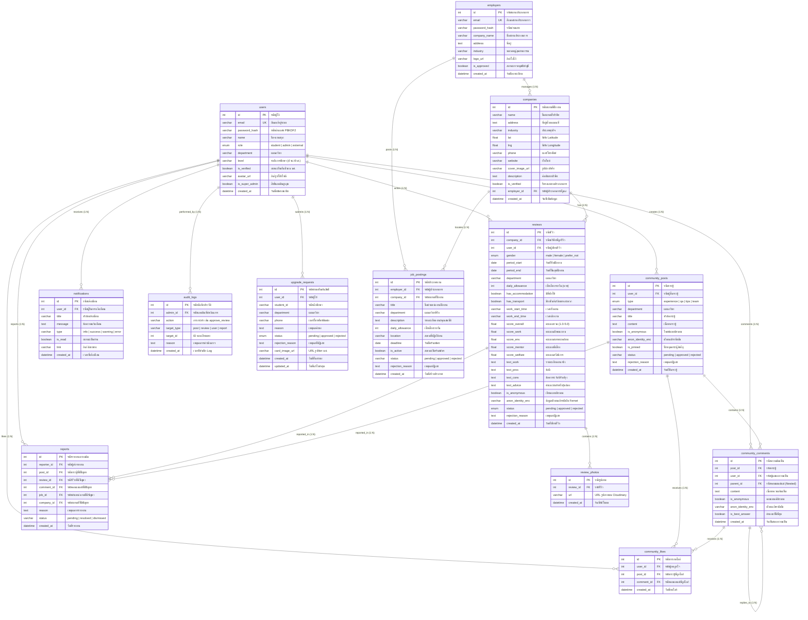

# เอกสารแผนภาพความสัมพันธ์ข้อมูล (ERD) และพจนานุกรมข้อมูล (Data Dictionary)
## โครงการระบบสารสนเทศเพื่อการฝึกงานและประเมินสถานประกอบการ (HTC Insight)
**วิทยาลัยเทคนิคหาดใหญ่ (Hatyai Technical College)**

---

## 1. แผนภาพความสัมพันธ์ของข้อมูล (Entity Relationship Diagram - ERD)

แผนภาพแสดงโครงสร้าง 13 ตาราง และความสัมพันธ์ระหว่าง Entity ทั้งหมดในระบบ HTC Insight:

---

## 2. พจนานุกรมข้อมูลรายตาราง (Data Dictionary)

### 📌 ตารางที่ 1: `users` (ตารางข้อมูลผู้ใช้งาน)
| คอลัมน์ | ชนิดข้อมูล | Constraints | ค่าเริ่มต้น | คำอธิบายภาษาไทย |
| :--- | :--- | :--- | :--- | :--- |
| `id` | `INT(11)` | PK, AUTO_INCREMENT | - | รหัสประจำตัวผู้ใช้ (Primary Key) |
| `email` | `VARCHAR(255)` | UNIQUE, NOT NULL | - | อีเมลสำหรับเข้าสู่ระบบ |
| `password_hash` | `VARCHAR(255)` | NOT NULL | - | รหัสผ่านที่เข้ารหัสด้วย PBKDF2-SHA256 |
| `name` | `VARCHAR(255)` | NOT NULL | - | ชื่อ-นามสกุล ของผู้ใช้งาน |
| `role` | `ENUM` | NOT NULL | `'student'` | สิทธิ์ผู้ใช้ (`student`, `admin`, `external`) |
| `department` | `VARCHAR(100)` | NULL | NULL | แผนกวิชาที่ศึกษาหรือสังกัด |
| `level` | `VARCHAR(100)` | NULL | NULL | ระดับชั้น เช่น ปวช., ปวส. |
| `is_verified` | `TINYINT(1)` | NOT NULL | `0` | ยืนยันตัวตน นศ. แล้วหรือยัง |
| `avatar_url` | `VARCHAR(500)` | NULL | NULL | URL รูปภาพประจำตัว |
| `is_super_admin` | `TINYINT(1)` | NOT NULL | `0` | สิทธิ์ผู้ดูแลระบบระดับสูงสุด |
| `created_at` | `DATETIME` | NOT NULL | `CURRENT_TIMESTAMP` | วันที่ลงทะเบียนเข้าใช้งาน |

---

### 📌 ตารางที่ 2: `employers` (ตารางข้อมูลบัญชีสถานประกอบการ)
| คอลัมน์ | ชนิดข้อมูล | Constraints | ค่าเริ่มต้น | คำอธิบายภาษาไทย |
| :--- | :--- | :--- | :--- | :--- |
| `id` | `INT(11)` | PK, AUTO_INCREMENT | - | รหัสบัญชีผู้ประกอบการ |
| `email` | `VARCHAR(255)` | UNIQUE, NOT NULL | - | อีเมลสำหรับเข้าสู่ระบบของสถานประกอบการ |
| `password_hash` | `VARCHAR(255)` | NOT NULL | - | รหัสผ่านแฮช |
| `company_name` | `VARCHAR(255)` | NOT NULL | - | ชื่อสถานประกอบการ / บริษัท |
| `address` | `TEXT` | NULL | NULL | ที่ตั้งสถานประกอบการ |
| `industry` | `VARCHAR(100)` | NULL | NULL | ประเภทธุรกิจ เช่น เทคโนโลยีสารสนเทศ |
| `logo_url` | `VARCHAR(500)` | NULL | NULL | URL โลโก้สถานประกอบการ |
| `is_approved` | `TINYINT(1)` | NOT NULL | `0` | อนุมัติการเปิดบัญชีโดยแอดมินแล้วหรือยัง |
| `created_at` | `DATETIME` | NOT NULL | `CURRENT_TIMESTAMP` | วันที่ลงทะเบียน |

---

### 📌 ตารางที่ 3: `companies` (ตารางข้อมูลสถานที่และพิกัดแผนที่)
| คอลัมน์ | ชนิดข้อมูล | Constraints | ค่าเริ่มต้น | คำอธิบายภาษาไทย |
| :--- | :--- | :--- | :--- | :--- |
| `id` | `INT(11)` | PK, AUTO_INCREMENT | - | รหัสสถานที่ฝึกงาน |
| `name` | `VARCHAR(255)` | NOT NULL, INDEX | - | ชื่อบริษัท / หน่วยงาน |
| `address` | `TEXT` | NULL | NULL | ที่อยู่สำหรับแสดงบนการ์ดและแผนที่ |
| `industry` | `VARCHAR(100)` | NULL | NULL | ประเภทธุรกิจ |
| `lat` | `FLOAT` | NULL | NULL | พิกัดละติจูด (Latitude) |
| `lng` | `FLOAT` | NULL | NULL | พิกัดลองจิจูด (Longitude) |
| `phone` | `VARCHAR(50)` | NULL | NULL | เบอร์โทรศัพท์ติดต่อ |
| `website` | `VARCHAR(500)` | NULL | NULL | เว็บไซต์บริษัท |
| `cover_image_url` | `VARCHAR(500)` | NULL | NULL | รูปภาพหน้าสถานประกอบการ |
| `description` | `TEXT` | NULL | NULL | คำอธิบายลักษณะการดำเนินงานของบริษัท |
| `is_verified` | `TINYINT(1)` | NOT NULL | `0` | สถานะได้รับการรับรองจากวิทยาลัย |
| `employer_id` | `INT(11)` | FK -> `employers(id)` | NULL | รหัสผู้ดูแลสถานประกอบการ |
| `created_at` | `DATETIME` | NOT NULL | `CURRENT_TIMESTAMP` | วันที่เพิ่มเข้าระบบ |

---

### 📌 ตารางที่ 4: `reviews` (ตารางบันทึกการรีวิวฝึกงาน)
| คอลัมน์ | ชนิดข้อมูล | Constraints | ค่าเริ่มต้น | คำอธิบายภาษาไทย |
| :--- | :--- | :--- | :--- | :--- |
| `id` | `INT(11)` | PK, AUTO_INCREMENT | - | รหัสรีวิว |
| `company_id` | `INT(11)` | FK -> `companies(id)` | - | สถานประกอบการที่ถูกรีวิว |
| `user_id` | `INT(11)` | FK -> `users(id)` | - | นักศึกษาผู้เขียนรีวิว |
| `gender` | `ENUM` | NOT NULL | `'prefer_not'` | เพศของผู้รีวิว |
| `period_start` | `DATE` | NOT NULL | - | วันที่เริ่มฝึกงาน |
| `period_end` | `DATE` | NOT NULL | - | วันที่สิ้นสุดการฝึกงาน |
| `department` | `VARCHAR(100)` | NULL | NULL | แผนกวิชาขณะฝึกงาน |
| `daily_allowance` | `INT(11)` | NULL | `0` | เบี้ยเลี้ยงรายวัน (บาท/วัน) |
| `has_accommodation` | `TINYINT(1)` | NOT NULL | `0` | มีที่พักให้ (1=มี, 0=ไม่มี) |
| `has_transport` | `TINYINT(1)` | NOT NULL | `0` | มีรถรับส่ง/เดินทางสะดวก |
| `work_start_time` | `VARCHAR(50)` | NULL | `'08:30'` | เวลาเริ่มทำงาน |
| `work_end_time` | `VARCHAR(50)` | NULL | `'17:00'` | เวลาเลิกงาน |
| `score_overall` | `FLOAT` | NOT NULL | - | คะแนนประเมินภาพรวม (1.0–5.0) |
| `score_work` | `FLOAT` | NULL | NULL | คะแนนลักษณะงาน |
| `score_env` | `FLOAT` | NULL | NULL | คะแนนสภาพแวดล้อมในที่ทำงาน |
| `score_mentor` | `FLOAT` | NULL | NULL | คะแนนการดูแลของพี่เลี้ยง |
| `score_welfare` | `FLOAT` | NULL | NULL | คะแนนสวัสดิการและเบี้ยเลี้ยง |
| `text_work` | `TEXT` | NOT NULL | - | อธิบายลักษณะงานที่ได้รับมอบหมายจริง |
| `text_pros` | `TEXT` | NULL | NULL | ข้อดีและจุดเด่น |
| `text_cons` | `TEXT` | NULL | NULL | ข้อควรระวังและสิ่งที่ควรปรับปรุง |
| `text_advice` | `TEXT` | NULL | NULL | คำแนะนำสำหรับรุ่นน้องที่จะมาฝึกงาน |
| `is_anonymous` | `TINYINT(1)` | NOT NULL | `0` | รีวิวแบบไม่เปิดเผยตัวตน (1=ใช่) |
| `anon_identity_enc` | `VARCHAR(500)` | NULL | NULL | ข้อมูลตัวตนผู้เขียนที่เข้ารหัส Fernet |
| `status` | `ENUM` | NOT NULL | `'pending'` | สถานะ (`pending`, `approved`, `rejected`) |
| `rejection_reason` | `TEXT` | NULL | NULL | เหตุผลการปฏิเสธของแอดมิน |
| `created_at` | `DATETIME` | NOT NULL | `CURRENT_TIMESTAMP` | วันที่บันทึกรีวิว |

---

### 📌 ตารางที่ 5: `job_postings` (ตารางประกาศรับสมัครงานฝึกงาน)
| คอลัมน์ | ชนิดข้อมูล | Constraints | ค่าเริ่มต้น | คำอธิบายภาษาไทย |
| :--- | :--- | :--- | :--- | :--- |
| `id` | `INT(11)` | PK, AUTO_INCREMENT | - | รหัสประกาศงาน |
| `employer_id` | `INT(11)` | FK -> `employers(id)` | - | ผู้ประกอบการที่ลงประกาศ |
| `company_id` | `INT(11)` | FK -> `companies(id)` | NULL | บริษัทที่ฝึกงาน (สำหรับปักหมุด) |
| `title` | `VARCHAR(255)` | NOT NULL | - | ชื่อตำแหน่งงานฝึกงาน |
| `department` | `VARCHAR(100)` | NULL | NULL | แผนกวิชาที่เปิดรับ |
| `description` | `TEXT` | NULL | NULL | รายละเอียดหน้าที่และคุณสมบัติ |
| `daily_allowance` | `INT(11)` | NULL | `0` | เบี้ยเลี้ยงรายวัน (บาท) |
| `location` | `VARCHAR(255)` | NULL | NULL | สถานที่ปฏิบัติงาน |
| `deadline` | `DATE` | NULL | NULL | วันปิดรับสมัคร |
| `is_active` | `TINYINT(1)` | NOT NULL | `1` | เปิดรับสมัครอยู่หรือไม่ |
| `status` | `VARCHAR(20)` | NOT NULL | `'pending'` | สถานะการอนุมัติประกาศ |
| `created_at` | `DATETIME` | NOT NULL | `CURRENT_TIMESTAMP` | วันที่สร้างประกาศ |

---

### 📌 ตารางที่ 6, 7, 8: กลุ่มตารางคอมมูนิตี้ (`community_posts`, `community_comments`, `community_likes`)

#### `community_posts` (ตารางกระทู้เว็บบอร์ด)
| คอลัมน์ | ชนิดข้อมูล | Constraints | ค่าเริ่มต้น | คำอธิบายภาษาไทย |
| :--- | :--- | :--- | :--- | :--- |
| `id` | `INT(11)` | PK, AUTO_INCREMENT | - | รหัสกระทู้ |
| `user_id` | `INT(11)` | FK -> `users(id)` | - | ผู้ตั้งกระทู้ |
| `type` | `ENUM` | NOT NULL | - | ประเภทกระทู้ (`experience`, `qa`, `tips`, `team`) |
| `department` | `VARCHAR(100)` | NULL | NULL | หมวดหมู่แผนกวิชา |
| `title` | `VARCHAR(255)` | NOT NULL | - | หัวข้อกระทู้ |
| `content` | `TEXT` | NOT NULL | - | เนื้อหากระทู้ |
| `is_anonymous` | `TINYINT(1)` | NOT NULL | `0` | โพสต์แบบนิรนามหรือไม่ |
| `anon_identity_enc` | `VARCHAR(500)` | NULL | NULL | ตัวตนผู้เขียนที่เข้ารหัสลับ |
| `is_pinned` | `TINYINT(1)` | NOT NULL | `0` | ปักหมุดกระทู้สำคัญบนสุด |
| `status` | `VARCHAR(20)` | NOT NULL | `'pending'` | สถานะอนุมัติ (`pending`, `approved`, `rejected`) |
| `created_at` | `DATETIME` | NOT NULL | `CURRENT_TIMESTAMP` | วันที่โพสต์กระทู้ |

#### `community_comments` (ตารางความคิดเห็นในกระทู้)
| คอลัมน์ | ชนิดข้อมูล | Constraints | ค่าเริ่มต้น | คำอธิบายภาษาไทย |
| :--- | :--- | :--- | :--- | :--- |
| `id` | `INT(11)` | PK, AUTO_INCREMENT | - | รหัสความคิดเห็น |
| `post_id` | `INT(11)` | FK -> `community_posts(id)` | - | กระทู้ที่แสดงความเห็น |
| `user_id` | `INT(11)` | FK -> `users(id)` | - | ผู้แสดงความคิดเห็น |
| `parent_id` | `INT(11)` | FK -> `community_comments(id)` | NULL | รหัสคอมเมนต์แม่ (สำหรับการตอบกลับ Nested) |
| `content` | `TEXT` | NOT NULL | - | ข้อความความคิดเห็น |
| `is_anonymous` | `TINYINT(1)` | NOT NULL | `0` | แสดงความคิดเห็นแบบนิรนาม |
| `is_best_answer` | `TINYINT(1)` | NOT NULL | `0` | คำตอบที่ได้รับเลือกเป็น Best Answer |
| `created_at` | `DATETIME` | NOT NULL | `CURRENT_TIMESTAMP` | วันที่แสดงความคิดเห็น |

#### `community_likes` (ตารางการกดถูกใจ)
| คอลัมน์ | ชนิดข้อมูล | Constraints | ค่าเริ่มต้น | คำอธิบายภาษาไทย |
| :--- | :--- | :--- | :--- | :--- |
| `id` | `INT(11)` | PK, AUTO_INCREMENT | - | รหัสการกดไลก์ |
| `user_id` | `INT(11)` | FK -> `users(id)` | - | ผู้กดถูกใจ |
| `post_id` | `INT(11)` | FK -> `community_posts(id)` | NULL | กระทู้ที่ถูกกดไลก์ (ถ้าไลก์กระทู้) |
| `comment_id` | `INT(11)` | FK -> `community_comments(id)` | NULL | ความคิดเห็นที่ถูกกดไลก์ (ถ้าไลก์คอมเมนต์) |
| `created_at` | `DATETIME` | NOT NULL | `CURRENT_TIMESTAMP` | วันที่กดไลก์ |

---

### 📌 ตารางที่ 9: `reports` (ตารางรายงานความไม่เหมาะสม)
| คอลัมน์ | ชนิดข้อมูล | Constraints | ค่าเริ่มต้น | คำอธิบายภาษาไทย |
| :--- | :--- | :--- | :--- | :--- |
| `id` | `INT(11)` | PK, AUTO_INCREMENT | - | รหัสรายงาน |
| `reporter_id` | `INT(11)` | FK -> `users(id)` | - | ผู้ใช้ที่กดรายงาน |
| `post_id` | `INT(11)` | FK -> `community_posts(id)` | NULL | กระทู้ที่มีปัญหา |
| `review_id` | `INT(11)` | FK -> `reviews(id)` | NULL | รีวิวที่มีปัญหา |
| `comment_id` | `INT(11)` | FK -> `community_comments(id)` | NULL | ความคิดเห็นที่มีปัญหา |
| `job_id` | `INT(11)` | FK -> `job_postings(id)` | NULL | ตำแหน่งงานที่มีปัญหา |
| `company_id` | `INT(11)` | FK -> `companies(id)` | NULL | บริษัทที่มีปัญหา |
| `reason` | `TEXT` | NOT NULL | - | สาเหตุการรายงาน เช่น สแปม, หมิ่นประมาท |
| `status` | `VARCHAR(20)` | NOT NULL | `'pending'` | สถานะ (`pending`, `resolved`, `dismissed`) |
| `created_at` | `DATETIME` | NOT NULL | `CURRENT_TIMESTAMP` | วันที่ส่งรายงาน |

---

### 📌 ตารางที่ 10: `audit_logs` (ตารางบันทึกประวัติแอดมิน)
| คอลัมน์ | ชนิดข้อมูล | Constraints | ค่าเริ่มต้น | คำอธิบายภาษาไทย |
| :--- | :--- | :--- | :--- | :--- |
| `id` | `INT(11)` | PK, AUTO_INCREMENT | - | รหัสประวัติการทำงาน |
| `admin_id` | `INT(11)` | FK -> `users(id)` | - | แอดมินผู้ดำเนินการ |
| `action` | `VARCHAR(100)` | NOT NULL | - | การกระทำ เช่น `approve_post`, `reveal_anonymous` |
| `target_type` | `VARCHAR(50)` | NULL | NULL | ชนิดข้อมูลเป้าหมาย (`post`, `review`, `user`) |
| `target_id` | `INT(11)` | NULL | NULL | รหัสของข้อมูลเป้าหมาย |
| `reason` | `TEXT` | NULL | NULL | เหตุผลประกอบการดำเนินการ |
| `created_at` | `DATETIME` | NOT NULL | `CURRENT_TIMESTAMP` | เวลาที่เกิดเหตุการณ์ |

---

### 📌 ตารางที่ 11: `upgrade_requests` (ตารางคำขอยืนยันสิทธิ์นักศึกษา)
| คอลัมน์ | ชนิดข้อมูล | Constraints | ค่าเริ่มต้น | คำอธิบายภาษาไทย |
| :--- | :--- | :--- | :--- | :--- |
| `id` | `INT(11)` | PK, AUTO_INCREMENT | - | รหัสคำขอ |
| `user_id` | `INT(11)` | FK -> `users(id)` | - | นักศึกษาผู้ยื่นคำขอ |
| `student_id` | `VARCHAR(50)` | NOT NULL | - | รหัสนักศึกษา เช่น 65309010001 |
| `department` | `VARCHAR(100)` | NULL | NULL | แผนกวิชา |
| `phone` | `VARCHAR(50)` | NULL | NULL | เบอร์โทรศัพท์ |
| `reason` | `TEXT` | NULL | NULL | เหตุผลความจำเป็นในการขอสิทธิ์ |
| `card_image_url` | `VARCHAR(500)` | NULL | NULL | ลิงก์รูปถ่ายบัตรนักศึกษา |
| `status` | `ENUM` | NOT NULL | `'pending'` | สถานะ (`pending`, `approved`, `rejected`) |
| `created_at` | `DATETIME` | NOT NULL | `CURRENT_TIMESTAMP` | วันที่ส่งคำขอ |
