# เอกสารการวิเคราะห์ระบบและ Use Case Specification
## โครงการระบบสารสนเทศเพื่อการฝึกงานและประเมินสถานประกอบการ (HTC Insight)
**วิทยาลัยเทคนิคหาดใหญ่ (Hatyai Technical College)**

---

## 1. วัตถุประสงค์ของระบบ (System Objectives)
ระบบ **HTC Insight** พัฒนาขึ้นเพื่อเป็นแพลตฟอร์มกลางสำหรับนักศึกษา ครู-อาจารย์ และสถานประกอบการ ในการ:
1. ค้นหาและตรวจสอบข้อมูลสถานประกอบการฝึกงานในพื้นที่ อ.หาดใหญ่ จ.สงขลา และพื้นที่ใกล้เคียง ผ่านแผนที่ Interactive Map
2. อ่านและเขียนรีวิวประสบการณ์ฝึกงานจากนักศึกษารุ่นพี่ พร้อมระบบปกป้องความปลอดภัยด้วยการเขียนแบบไม่เปิดเผยตัวตน (Anonymous Review with End-to-End Cryptography)
3. เป็นศูนย์กลางเว็บบอร์ดชุมชน (Community Q&A) สำหรับสอบถามข้อมูล สมัครงาน และแบ่งปันเทคนิค
4. เป็นช่องทางให้ผู้ประกอบการ (Employers) ประกาศรับสมัครนักศึกษาฝึกงานตรงตามสาขาวิชา
5. ให้ผู้ดูแลระบบ (Admin / Super Admin) คัดกรองความถูกต้อง อนุมัติข้อมูล และตรวจสอบความโปร่งใสผ่าน Audit Trail

---

## 2. กลุ่มผู้ใช้งานระบบ (System Actors)

| Actor | คำอธิบายบทบาทและสิทธิ์การใช้งาน |
| :--- | :--- |
| **1. Guest / General User (ผู้ใช้ทั่วไป / ผู้เยี่ยมชม)** | สามารถค้นหาสถานประกอบการ, ดูแผนที่, อ่านรีวิวที่ผ่านการอนุมัติ, อ่านกระทู้สาธารณะ และค้นหาประกาศรับสมัครงาน |
| **2. Student (นักศึกษาวิทยาลัยเทคนิคหาดใหญ่)** | เข้าสู่ระบบด้วยอีเมล `@htc.ac.th`, เขียนรีวิวสถานประกอบการ (แบบเปิดเผยหรือนิรนาม), ตั้งกระทู้/คอมเมนต์/กดไลก์ใน Community, บันทึกสถานประกอบการที่สนใจ, ส่งคำขอยืนยันสิทธิ์นักศึกษา |
| **3. Employer (ตัวแทนสถานประกอบการ)** | ลงทะเบียนบัญชีสถานประกอบการ, จัดการข้อมูลบริษัท, ลงประกาศรับสมัครนักศึกษาฝึกงาน (Job Postings), กำหนดเบี้ยเลี้ยงและคุณสมบัติ |
| **4. Admin (ผู้ดูแลระบบ)** | คัดกรองและอนุมัติรีวิว (Approve/Reject), อนุมัติกระทู้ Community, อนุมัติตำแหน่งงาน, อนุมัติคำขอยืนยันสิทธิ์นักศึกษา, จัดการข้อร้องเรียน/สแปม (Reports), ถอดรหัสตัวตนผู้เขียนรีวิวนิรนามในกรณีฉุกเฉิน (Reveal Identity) |
| **5. Super Admin (ผู้ดูแลระบบระดับสูง)** | มีสิทธิ์ทุกอย่างของ Admin และสามารถแต่งตั้ง/ปลดสิทธิ์ Admin, ระงับบัญชีผู้ใช้งาน (Ban/Unban) และตรวจสอบประวัติการทำงาน (Audit Logs) ทั้งหมด |

---

## 3. Use Case Diagram (แผนภาพ Use Case รวม)

```mermaid
graph TD
    %% Actors
    Guest((ผู้เยี่ยมชม / Guest))
    Student((นักศึกษา / Student))
    Employer((ผู้ประกอบการ / Employer))
    Admin((ผู้ดูแลระบบ / Admin))
    SuperAdmin((ผู้ดูแลระบบสูงสุด / Super Admin))

    %% Student Inherits Guest
    Student -.-> Guest

    %% Subsystems
    subgraph "ระบบค้นหาและข้อมูลสถานประกอบการ (Company & Insights)"
        UC1[UC-01: ค้นหาสถานประกอบการและดูบนแผนที่]
        UC2[UC-02: ดูรายละเอียดและคะแนนรีวิวบริษัท]
        UC3[UC-03: เขียนรีวิวประสบการณ์ฝึกงาน]
        UC4[UC-04: เลือกเขียนรีวิวแบบนิรนาม Anonymous]
    end

    subgraph "ระบบคอมมูนิตี้และถาม-ตอบ (Community Forum)"
        UC5[UC-05: อ่านกระทู้และค้นหาตามแผนก]
        UC6[UC-06: ตั้งกระทู้และแสดงความคิดเห็น]
        UC7[UC-07: กดไลก์และเลือกคำตอบที่ดีที่สุด Best Answer]
    end

    subgraph "ระบบรับสมัครงานฝึกงาน (Job Opportunities)"
        UC8[UC-08: ค้นหาตำแหน่งงานฝึกงานที่เปิดรับ]
        UC9[UC-09: สร้างและแก้ไขประกาศรับสมัครงาน]
        UC10[UC-10: ลงทะเบียนและจัดการข้อมูลบริษัท]
    end

    subgraph "ระบบสมาชิกและความปลอดภัย (Auth & Profile)"
        UC11[UC-11: สมัครสมาชิกและเข้าสู่ระบบด้วย JWT]
        UC12[UC-12: ยื่นคำขอยืนยันสิทธิ์นักศึกษาด้วยบัตร นศ.]
        UC13[UC-13: ส่งรายงานความไม่เหมาะสม Report]
    end

    subgraph "ระบบควบคุมและกำกับดูแล (Admin Control Center)"
        UC14[UC-14: คัดกรองและอนุมัติรีวิว/กระทู้/ตำแหน่งงาน]
        UC15[UC-15: ถอดรหัสตัวตนนิรนาม Reveal Identity พร้อมบันทึก Log]
        UC16[UC-16: ตรวจสอบและจัดการรายงาน Report]
        UC17[UC-17: จัดการสิทธิ์ผู้ใช้และตรวจสอบ Audit Logs]
    end

    %% Guest Connections
    Guest --> UC1
    Guest --> UC2
    Guest --> UC5
    Guest --> UC8
    Guest --> UC11

    %% Student Connections
    Student --> UC3
    Student --> UC4
    Student --> UC6
    Student --> UC7
    Student --> UC12
    Student --> UC13

    %% Employer Connections
    Employer --> UC9
    Employer --> UC10

    %% Admin Connections
    Admin --> UC14
    Admin --> UC15
    Admin --> UC16

    %% Super Admin Connections
    SuperAdmin --> Admin
    SuperAdmin --> UC17
```

---

## 4. รายละเอียด Use Case สำคัญ (Detailed Use Case Specifications)

### 🔹 UC-03 & UC-04: เขียนรีวิวประสบการณ์ฝึกงาน (Write Internship Review)
- **Primary Actor**: Student (นักศึกษาที่ผ่านการยืนยันตัวตน)
- **Pre-conditions**: นักศึกษาเข้าสู่ระบบและมีสถานะ `is_verified = 1`
- **Main Flow**:
  1. นักศึกษาเลือกสถานประกอบการที่ต้องการรีวิว หรือระบุข้อมูลสถานประกอบการใหม่
  2. ระบุช่วงเวลาการฝึกงาน แผนกวิชา และเวลาเข้า-เลิกงาน
  3. ให้คะแนน 5 มิติ (ภาพรวม, ลักษณะงาน, สภาพแวดล้อม, พี่เลี้ยง, สวัสดิการ/เบี้ยเลี้ยง)
  4. เขียนข้อความอธิบายลักษณะงาน ข้อดี ข้อควรระวัง และคำแนะนำ
  5. เลือกว่าจะ **"เปิดเผยชื่อ"** หรือ **"ไม่เปิดเผยตัวตน (Anonymous)"**
  6. หากเลือก Anonymous ระบบจะนำข้อมูลตัวตนไปเข้ารหัสผ่าน `Fernet Symmetric Encryption` ก่อนบันทึกลงในคอลัมน์ `anon_identity_enc`
  7. ระบบบันทึกรีวิวด้วยสถานะ `pending` เพื่อรอการตรวจสอบจากผู้ดูแลระบบ
- **Post-conditions**: รีวิวถูกส่งเข้าคิวรออนุมัติใน Admin Dashboard

---

### 🔹 UC-15: การถอดรหัสตัวตนนิรนาม (Reveal Anonymous Identity with Audit Trail)
- **Primary Actor**: Admin / Super Admin
- **Pre-conditions**: ผู้ดูแลระบบเข้าสู่ระบบและมีสิทธิ์ `role = admin`
- **Trigger**: มีรายงานความผิดร้ายแรง (เช่น มีการหมิ่นประมาท หรือให้ข้อมูลเท็จที่สร้างความเสียหาย)
- **Main Flow**:
  1. แอดมินกดปุ่ม **"Reveal Identity"** ที่การ์ดรีวิวที่เขียนแบบนิรนาม
  2. ระบบแสดง Modal เพื่อขอให้แอดมิน **ระบุเหตุผลความจำเป็นในการเปิดเผยข้อมูล**
  3. แอดมินกรอกเหตุผลและกดยืนยัน
  4. Backend ถอดรหัสลับ `Fernet` และส่งชื่อ-อีเมลจริงของผู้เขียนกลับมาให้แอดมินดู
  5. ระบบบันทึกการกระทำลงในตาราง `audit_logs` อัตโนมัติ (บันทึก admin_id, action='reveal_anonymous', target_id, reason, created_at)
- **Post-conditions**: แอดมินเห็นตัวตนจริง และมีประวัติบันทึกความโปร่งใสใน Audit Logs

---

### 🔹 UC-09 & UC-10: การประกาศรับสมัครงานฝึกงานของผู้ประกอบการ (Employer Job Posting)
- **Primary Actor**: Employer (สถานประกอบการ)
- **Pre-conditions**: ผู้ประกอบการลงทะเบียนและได้รับการอนุมัติบัญชีจากแอดมิน (`is_approved = 1`)
- **Main Flow**:
  1. ผู้ประกอบการเข้าสู่ระบบ Employer Dashboard
  2. กรอกข้อมูลตำแหน่งงาน (ชื่อตำแหน่ง, สาขา/แผนกวิชา, รายละเอียดงาน, เบี้ยเลี้ยงรายวัน, วันปิดรับสมัคร)
  3. ปักหมุดสถานที่ปฏิบัติงานบนแผนที่
  4. บันทึกและส่งข้อมูลเข้าสู่ระบบ
- **Post-conditions**: ตำแหน่งงานแสดงในหน้ารวมงานฝึกงาน ([`/jobs`](file:///e:/HTC%20Insight/frontend/app/jobs/page.tsx)) และแสดงหมุดงานบน Interactive Map
